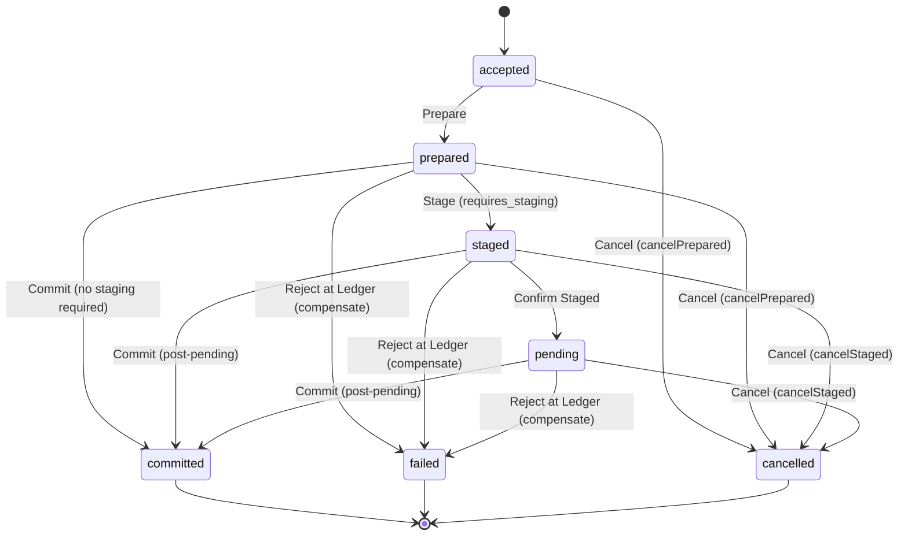
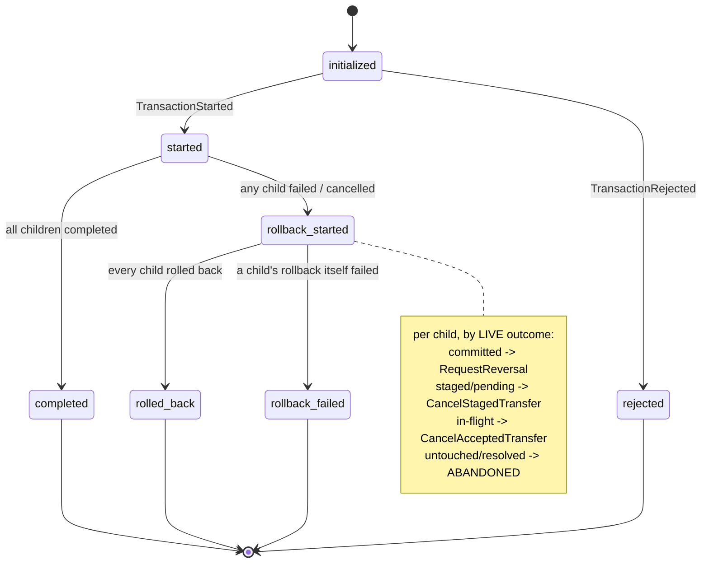
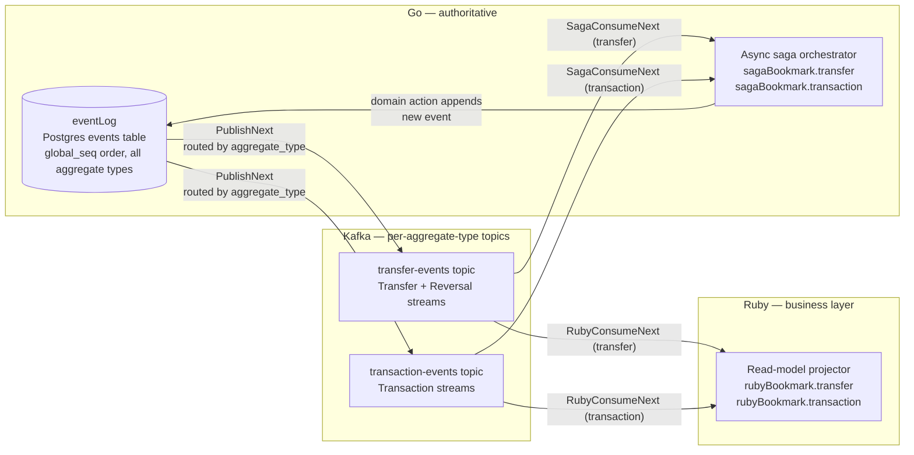

# PROTOTYPE — Async, Kafka-driven saga vs. today's sync saga

> **Throwaway and unmaintained.** This document and its companion
> [`prototype-async-saga-state-model.html`](prototype-async-saga-state-model.html) exist to answer one design
> question before real code is written. Neither is production material, and neither is kept in step with the
> code — they model the design as of 2026-09-07. They are retained here only because the ADRs cite their
> numbers; delete this directory once the implementation lands.

**To run it:** open `prototype-async-saga-state-model.html` in a browser (double-click, or `open` on macOS).
No build step, no server, no dependencies — one self-contained file.

---

## The question

Today's `runSaga` (`go/internal/transfer/saga.go`, `go/internal/transaction/saga.go`) is an in-process loop:
it folds an aggregate's event stream into a state, dispatches exactly one next step synchronously
(calling TigerBeetle inline), appends one outcome event, and repeats until it hits a wait-state or a
terminal state. It's idempotent by construction and self-heals by re-running from wherever the log left off.

**If instead a saga orchestrator reacts to domain events delivered through Kafka** — where delivery can be
delayed, duplicated or reordered, where publication happens via CDC or a polling relay, where topics are
unified or split per aggregate type, and where Ruby (or any CQRS-style read model) consumes the same stream
independently — **does the Transfer/Transaction state model still reach correct terminal outcomes, or does it
produce states the pieces would disagree about?**

Cutting across that is a second question the delivery mechanics keep answering for you: **is a delivered message
the fact the orchestrator folds, or merely a nudge to re-fold authoritative state?** Postgres remains the source
of truth in both readings, and today's `reconcileInFlight` already takes the second one — it reads each child's
live `transfer.Outcome` rather than trusting anything it was handed
(`go/internal/transaction/saga.go:508`). Which reading the async orchestrator adopts decides how much duplicate,
out-of-order and missing delivery can actually hurt, so it is a toggle in the prototype rather than an assumption.

## The answer

**Yes — under one specific configuration, which the prototype found rather than assumed:**

| Knob | Chosen | Load-bearing? |
| --- | --- | --- |
| Publication | **CDC** | Yes — reverses the pre-build decision below |
| Topic topology | **One topic per aggregate type** | No — correctness is identical either way |
| Saga handler | **Event-as-trigger** | Yes |
| Partition key | **Aggregate id** | Yes |

2,000 seeded fuzz runs × 400 steps in that configuration: **0 invariant violations, 0 stalls, and all 2,000 runs
reached a terminal Transaction state.** Not merely "nothing was corrupted" — every random interleaving of
duplicate, reordered and delayed delivery, orchestrator crashes and restarts actually *finished*. Each single
deviation degrades it, and differently:

| Deviation | Violations | Stalls | Reached terminal |
| --- | --- | --- | --- |
| *(chosen)* | 0 / 2000 | 0 | 2000 |
| Polling instead of CDC | 1097 / 2000 | 0 | 1378 |
| Unified topic | 0 / 2000 | 0 | 2000 |
| Event-as-data | 0 / 2000 | 13 | 1945 |
| No partition key | 430 / 2000 | 0 | 1828 |

Read that table as three separate claims. The partition key and the publisher protect *correctness* (they stop
the read model being wrong). The handler protects *liveness* (event-as-data corrupts nothing, but parks 55 runs
in 2,000 forever). And the topology protects neither — per-type topics survive on their other merits, mirroring
the `aggregate_type` column and matching what Debezium's outbox router does, not on anything measured here.

## Why this is being considered

The codebase already anticipates moving off the sync model:

- The `events` table's `global_seq` index (`go/db/migrations/00001_create_events.up.sql`) exists, per its own
  migration comment, so "every projection/process manager reads forward from a bookmark on this index" — unused today.
- `proto/transfer/v1/transfer.proto` defines unused `Start*`/`*Started`/`Complete*` event triplets that the sync
  saga deliberately skips, reserved "for a future async process manager" (see `currentState`'s doc comment,
  `go/internal/transfer/saga.go:69-78`).
- Ruby has **zero** visibility into transaction/transfer state today — no polling, no projection, no messaging
  infrastructure, no GraphQL types for it. This is greenfield, not a migration off an existing pattern.

## Settled before building — and what the prototype did to those decisions

| Decision | Outcome |
| --- | --- |
| **Motivation** | Not just "Ruby needs to read status" — Ruby needs to *react* (update its tracking object, trigger communications, sometimes originate a follow-on Transaction), and the saga itself needs Kafka's durable, resumable consumer offsets so a halted system picks back up per aggregate type. |
| **Infra reality** | Net-new, self-hosted: Kafka via Docker locally, Terraform for real environments. Not plugging into an existing platform — treat the cost as real. |
| **Consistency contract** | Eventual consistency is expected and fine; it matches the event-sourced model already in place. |
| **Rollout** | Not in production yet → **hard cutover**. No strangler/parallel-run transition to design. |
| **Orchestration style** | **Process manager** (one orchestrating consumer per aggregate type), chosen for debuggability, central logging, and straightforward error recovery. Choreography is explicitly deferred until scale demands it. |
| **Publication mechanism** | ~~Polling relay for v1, not CDC~~ → **REVERSED to CDC.** The stated reason for polling was that `events.payload` is raw protobuf `BYTEA` and Debezium's outbox-router expects JSON, so unwrapping it needs a custom transform. Under the chosen handler that objection largely dissolves — see below — while polling's own failure mode turned out to be unfixable by any other knob: 1097 violations in 2000 runs, against 0 for CDC. |
| **Partition key** | **Was missing from this table** → **SETTLED as aggregate id.** Ordering is a per-partition guarantee, so the key decides whether out-of-order delivery is even possible; nothing else in this list means anything without it. Aggregate id is the weakest sufficient choice — transaction id measured identically and costs a partition per transaction. |
| **Topic topology** | **One topic per aggregate type** (`transfer-events`, `transaction-events`), mirroring the existing `aggregate_type` column — what Debezium's outbox-router does when one table serves multiple aggregate types. **Unchanged, but note the prototype measured it as correctness-neutral**: unified scored identically, so this rests on the column-mirroring and router arguments alone, not on anything the model demonstrates. |
| **Handler semantics** | ~~Deliberately left open~~ → **SETTLED as event-as-trigger:** a delivered message means only "this aggregate moved", and the orchestrator re-folds authoritative state, which is what `reconcileInFlight` already does today. Scenarios 6 and 8 are the same steps under each. |
| **Ruby write-back** | Real and in scope: an ACH Transaction posting can cause Ruby to auto-trigger a follow-on Transaction (e.g. auto-invest) back on Go, using a deterministic derived id (mirroring `detid.New(transactionID + ":reversal:" + ...)`, `go/internal/transaction/saga.go:597`) so redelivery can't double-originate it. |

## Scope of the model

One **Transaction** with three child **Transfers** forming a DAG with a join:

- **Transfer A** — no staging required; mirrors the `prepared → committed` branch.
- **Transfer B** — staging required; mirrors `prepared → staged → pending → committed`, the one branch that
  genuinely waits on the outside world.
- **Transfer C** — no staging, **depends on A and B**, so `readyToRun` and `readyToRollback` actually order
  something: C dispatches last and is undone first.

**Reversals are modelled as real child aggregates.** Reversing a committed child creates a new Transfer with a
deterministic id (`rev:A`), inheriting the original's staging requirement exactly as `rollbackChild` passes
`Stage: spec.GetStage()` through to `RequestReversal`. It runs its own saga and its events flow through the
transfer topic like any other Transfer's.

The join is load-bearing, not decoration. With a two-child chain the only reversible child is the one nothing
depends on, so the staging-required child can never be the one reversed — and the staged-Reversal path, the most
interesting case in the whole rollback design, is unreachable.

No wallets, tokens, or operations are modelled. TigerBeetle is a black-box `ok`/`rejected` result, matching how
`submitBatch` is treated in the real code. This is deliberately the smallest model that exercises
`transaction/saga.go`'s DAG orchestration (`dispatchReady`, `reconcileInFlight`, `rollbackChild`) and
`transfer/saga.go`'s wait-state behaviour.

### Transfer state machine

One instance each for Transfer A and Transfer B. States and legality mirror `transferState`
(`go/internal/transfer/saga.go:35-46`).

### Transaction state machine

States mirror `transactionState` (`go/internal/transaction/saga.go:22-33`); rollback branches per child by that
child's **live** outcome, exactly as `rollbackChild` does (`go/internal/transaction/saga.go:577-662`).

### Delivery layer — the part actually being prototyped

Postgres stays the one source of truth, routed by `aggregate_type` into one topic per aggregate type. Each
consumer holds its own bookmark per topic, which is what turns lag — and, under a polling publisher, structural
gaps — into inspectable facts rather than assumptions.

Splitting the topic doesn't remove either consumer's dependency on *both* streams. Under a unified topic that
dependency is satisfied automatically by draining one queue; under per-type topics it becomes an explicit
cross-topic correlation the consumer has to get right — see Scenario 6.

## What you can click

**Per transfer (×2):** Accept · Prepare · Stage · Confirm Staged · Commit · Reject at Ledger · Cancel

**Transaction:** Start Transaction · Dispatch Ready Children · Roll Back Child

**Invariants:** Fuzz 200 Steps From Here · Hunt For A Violation (50 × 200 steps)

**Delivery / plumbing:** Publisher Mode toggle (CDC ⇄ Polling) · Topic Topology toggle (Unified ⇄ Per-Type) ·
Saga Handler toggle (Event-as-Data ⇄ Event-as-Trigger) · Partition Key cycle (None → Aggregate → Transaction) ·
Publish Next Event · Duplicate Last Delivery · Reorder Pending Pair · Simulate Relay Restart (Polling only) ·
Crash Saga Orchestrator · Restart Saga Orchestrator · Reset

**Per topic:** Saga: Consume Next · Ruby: Consume Next (collapses to a single unlabelled pair under Unified topology)

**Ruby follow-on:** Originate Follow-On (Transfer A / Transfer B / Transaction)

Illegal actions stay visible but disabled, with the reason on hover — the shape of the legality surface is itself
part of what's being reviewed.

## The invariants, and why they are checked rather than eyeballed

The question is whether the pieces can end up disagreeing, so the demo answers it rather than asking you to
compare two panels. Five invariants are recomputed on every action and reported with a four-way status, because
under eventual consistency a disagreement is only a defect once there is nothing left to consume:

| Status | Meaning |
| --- | --- |
| **holds** | true right now |
| **lagging** | differs, but an undelivered message exists that would resolve it — the expected, benign case |
| **stalled** | nothing left to deliver, yet the system is parked short of where a re-fold would take it. Not wrong, just never finishing |
| **broken** | wrong, and no further delivery can fix it |

1. **Read model agrees with the ledger of record.** Per aggregate, and only counted as broken once no pending
   message could still move it — pending is computed against messages that would actually change Ruby's state,
   so per-child bookkeeping events on the transaction topic can't mask a real disagreement as lag.
2. **Read model observed a legal path.** Every state change Ruby applies must be a single legal edge of the
   state machine, with self-loops exempt (that is redelivery, and absorbing it is the whole LWW argument). The
   edge table is derived from the same action table the buttons are gated on, so the two can't drift.
3. **Reconciled children match live transfers.** A child recorded `completed` whose Transfer isn't `committed`
   means something folded a stale fact.
4. **Terminal transaction implies terminal children.** No Transaction closes over an unresolved child.
5. **No progress left on the table.** Asked by actually re-folding a copy of the model: if the orchestrator has
   drained every topic and a fresh fold would *still* move the Transaction, no future delivery will move it
   either. That is the difference between "waiting" and "stuck", and it is what makes Scenario 6 legible.

**The fuzzer** picks uniformly from whatever is legal at each step — domain steps, publishes, duplicates,
reorders, consumes, crashes — weighted so delivery churn outpaces domain progress, and stops the instant an
invariant breaks, leaving the model and the activity log sitting on the reproduction. Runs are seeded and the
seed is reported. It deliberately never touches publisher mode, topology or handler semantics: those are the
knobs under test, so you set them and hunt under each. Toggling topology mid-run would also strand published
messages and manufacture failures that say nothing about the design.

### What the fuzzer found

Both of these were reproduced from a cold start, and neither was reachable from the seven scripted scenarios:

- **Same-aggregate reordering permanently corrupts the read model — under CDC, with nothing dropped.** Transfer
  B's own `Accepted` and `Prepared` swap on the transfer topic, Ruby walks `prepared → accepted`, and it never
  recovers. This falsifies Scenario 1's "Ruby only ever lags, never disagrees" and the note below that last-
  write-wins needs no dedup: LWW is idempotent under *duplication* and defenceless under *reordering*. It is
  fixed by a partition key, which was the decision missing from the table above — see below.
- **The stall is not caused by the topology.** Across 500 seeded runs per configuration with ordered, lossless
  delivery, `event-as-data` ends stalled in 4–6 runs per 500 under *both* per-type and unified topics, while
  `event-as-trigger` ends stalled in 0. Independent confirmation of Scenarios 6 and 8, and it rules out the
  unified topic as the remedy.

Under ordered, lossless delivery — duplicates and orchestrator crashes still in the mix — 2,500 runs × 300 steps
produced **zero** violations across every configuration, so the checks are not simply firing on churn.

### What choosing CDC actually costs, now that it is chosen

The pre-build argument for polling was the protobuf payload. Under **event-as-trigger that argument mostly
goes away**, because neither consumer's main path reads the payload:

- The **orchestrator** never decodes anything. A trigger only has to say *which aggregate moved*, and
  `aggregate_type` / `aggregate_id` are plain `TEXT` columns on the `events` table — no transform, no unwrapping.
- **Ruby's projection** needs `event_type` and `aggregate_id`, also plain columns. Debezium emits row columns as
  JSON with `payload` base64-encoded, so Ruby only has to protobuf-decode when it wants body *fields*, which on
  this model is the follow-on write-back alone — and `proto/` already generates Ruby classes for exactly that.

So "a custom transform just to unwrap it" overstates the cost: no SMT is needed for either state-tracking path.
What CDC does cost, and what the original table never named, is operational:

- **`wal_level = logical`.** The stack currently runs `replica` (verified against the running
  `money_flow-postgres-1`), so this is a Postgres restart locally and a parameter-group change plus reboot in
  any Terraform-managed environment.
- **A replication slot, and the discipline that comes with it.** A stalled or deleted connector either pins WAL
  until the disk fills or silently loses its position. That is a genuinely different on-call surface from a
  polling worker you can restart with impunity, and it belongs in the ADR as a named cost.

The reason to pay it is that polling's failure mode has no cheap fix. `global_seq` is
`BIGINT GENERATED ALWAYS AS IDENTITY`: identity values are allocated at INSERT and become visible at COMMIT, so
a cursor-based relay permanently skips any event whose sequence was allocated before, but committed after, one
it already read. No partition key helps — the message was never published at all.

### What the async rollback model found

The rollback path was the last unvalidated part of the design, and the only one where the prototype was
extended *after* the configuration was chosen. Under CDC / per-type / trigger / key=aggregate,
**3,000 runs × 500 steps: 0 violations, 0 stalls, all 3,000 reaching a terminal Transaction state**
(2,572 `rolled_back`, 425 `rollback_failed`, 3 `completed`). 477 runs created a Reversal; 137 created a *staged*
Reversal.

- **The symmetric fix holds.** A child parks in `rollback_requested` and is resolved from its Reversal's live
  outcome — structurally identical to how `childRequested` is resolved by `reconcileInFlight`. This was a
  hypothesis before it was built; it is now measured. Written up as
  [`go/docs/adr/0002`](../go/docs/adr/0002-asynchronous-rollback-and-reversal-reconciliation.md).
- **Rollback can legitimately wait for days.** A Reversal inherits its original's staging requirement, so
  reversing a staged Transfer creates a staged Reversal that parks until the outside world answers. The stall
  invariant had to learn the difference between *waiting on a non-terminal child* and *drained and not
  progressing*. Operational alerting needs the same split: "in `rollback_started` for more than N hours" would
  fire on correct behaviour.
- **The invariants caught a bug in the model's own read-model projection.** `TransactionRollbackFailed` was
  missing from the projector's event→state map, so Ruby silently ignored it and would have shown
  `rollback_started` forever while Go had recorded `rollback_failed`. Nothing failed loudly — a projector that
  drops an unrecognised event type looks exactly like one that is merely behind. That is now a named
  requirement in [`ruby/docs/adr/0001`](../ruby/docs/adr/0001-read-model-consumer-and-follow-on-write-back.md):
  an unmapped event type must be a loud error, not a silent skip.

### What the partition key is worth

500 seeded runs × 300 steps per configuration, counting runs that ended with a broken invariant:

| Configuration | key=none | key=aggregate | key=transaction |
| --- | --- | --- | --- |
| CDC, per-type topics | 125 / 500 | **0 / 500** | **0 / 500** |
| CDC, unified topic | 141 / 500 | **0 / 500** | **0 / 500** |
| Polling, per-type topics | 324 / 500 | 266 / 500 | 266 / 500 |

Three things fall out of that:

1. **Keying by aggregate id eliminates the corruption completely**, under both topologies. Every violation the
   fuzzer finds under CDC is a reordering violation, and keying removes the possibility rather than reducing the
   odds — the Reorder button refuses a same-aggregate pair outright, and says so.
2. **Keying by transaction id buys no additional correctness** — 0/500 either way — so `aggregate` is the weakest
   sufficient key and the stronger one should be justified on other grounds if at all. Its real trade is
   throughput, which this model cannot show: one partition per transaction also means one consumer thread per
   transaction, which is the same property that would remove concurrent appends to a Transaction's stream.
   Note also that two topics are independent partitions *whatever* you key on, so under per-type topology a
   transaction key still buys nothing across the transfer/transaction split; only unified topology plus a
   transaction key gives total per-transaction order. Scenario 3 becomes unreachable under it, which is a fair
   summary of what it costs: cross-aggregate reordering is exactly what `rollbackChild`'s live-outcome read was
   already written to tolerate.
3. **The key does not rescue polling — and this is the finding that touches a decision marked settled.** Under a
   relay that can miss an event, violations only fall from 324 to 266, and the residue is no longer reordering:
   it is 202 runs where Ruby can never catch up because the message was never published, plus 64 where Ruby's
   observed path skips a state outright. No partition key can order a message that does not exist. Publication
   completeness and delivery ordering are independent problems, and **"polling relay for v1" currently has no
   answer to the first one.** That matters more than the prototype's own Scenario 5 suggests, because
   `global_seq` is `BIGINT GENERATED ALWAYS AS IDENTITY` (`go/db/migrations/00001_create_events.up.sql`):
   identity values are allocated at INSERT and become visible at COMMIT, so a relay reading
   `WHERE global_seq > bookmark ORDER BY global_seq` will *silently and permanently* skip any event whose
   sequence was allocated before, but committed after, one it has already read. That needs no restart and no
   incident — just two concurrent transactions. Before the polling decision is written into an ADR it needs a
   named mitigation: a lag window, `pg_snapshot_xmin(pg_current_snapshot())` tracking, or a `published_at`
   outbox flag instead of a cursor.

## The ten scenarios

1. **Happy path** — CDC mode, both transfers driven to `committed` and both consumers kept in lockstep.
   *Watch:* Go-authoritative and Ruby panels always agree; Ruby only ever lags by bookmark position. That holds
   *on this path*, where messages arrive in order — it is not a general property, and the fuzzer breaks it under
   CDC as soon as two of one aggregate's own messages swap.
2. **Duplicate delivery** — Transfer B driven to `staged`, then its last delivery duplicated.
   *Watch:* the saga's second consume of the same event is a no-op — the async analogue of `appendSagaStep`'s real
   idempotency guard (`go/internal/transfer/saga.go:307-328`). The single most important property to hold before
   trusting at-least-once delivery.
3. **Reordered delivery** — Transfer A left at `prepared`, Transfer B rejected at the ledger while `staged`, and
   their two pending messages swapped so B's `Failed` arrives before A's `Prepared`.
   *Watch:* `rollbackChild` keys off each child's **live** outcome, not stream position, so rollback still lands
   correctly — A cancelled (in-flight), B abandoned (already failed).
4. **Illegal attempt** — orchestrator crashed mid-flight and a consume attempted, then restarted and `Commit`
   attempted directly from `prepared` on the staging-required transfer.
   *Watch:* both refusals fire, and they come from two *independent* guards — delivery-layer aliveness and
   domain-level legality don't leak into each other.
5. **Polling gap** — Polling mode; a relay restart skips publishing Transfer A's `Prepared` event entirely.
   *Watch:* Ruby's projection jumps straight from `accepted` to `committed` — a structural hole, not just lag.
   This is the concrete CDC-vs-polling trade-off.
6. **Reconciliation gap (event-as-data)** — both transfers driven to `committed` and reconciled via the transfer
   topic, while the transaction topic is deliberately never consumed.
   *Watch:* both children show `completed`, yet the Transaction stays parked in `started`. Nothing is broken —
   but "done" now depends on cross-topic consumption discipline that a unified topic gave you for free.
   Then run Scenario 8 before attributing that to the topology.
7. **Ruby's follow-on** — Transfer A completes, Ruby consumes it and originates a follow-on transaction with a
   deterministic id, then the triggering event is redelivered.
   *Watch:* the second origination is a no-op. This is the auto-invest case, and the direct analogue of Scenario 2
   for Ruby's own write path.
8. **Same gap, event-as-trigger** — Scenario 6's steps verbatim, with the handler toggled to trigger semantics.
   The transaction topic is still never consumed.
   *Watch:* the Transaction reaches `completed` anyway, off the same 13 events, because every wake-up re-folds
   live state instead of folding the message it was handed. Scenario 6's stall is a property of the handler
   shape, not of splitting the topic — worth settling before the topology decision gets written into an ADR as
   its cause.
9. **Read-model corruption (no key)** — CDC, nothing dropped, nothing crashed. Transfer A's own `Prepared` and
   `Committed` are swapped, which an unkeyed producer permits because round-robin puts them in different
   partitions.
   *Watch:* Ruby settles on `prepared` while Go is `committed`, with nothing left to consume, and never recovers.
   Then cycle the key to aggregate id and re-run: the Reorder button refuses the swap outright, because those
   two messages now share a partition. The fuzzer's finding as a fixed path.
10. **Async rollback with a staged reversal** — A and B commit, C unblocks and fails at the ledger, the whole
    Transaction rolls back.
    *Watch:* C is undone first (DAG order); a committed child can no longer be undone in one step, so A and B
    park in `rollback_requested` while their Reversals run their own sagas; and `rev:B` inherits B's staging
    requirement, so rollback waits on the outside world and the invariant bar says *waiting*, not *stalled*.
    Drive `rev:B` to committed for `rolled_back`, or reject it at the ledger for `TransactionRollbackFailed` —
    which has no other route once the inline confirmation is gone.

## Implementation notes (things the build surfaced)

These are refinements or corrections discovered while making the model actually run. They matter for anyone
reading the code:

- **Under event-as-data, the transaction only "notices" completion when it consumes its own topic.**
  Reconciliation *facts* (`children[X] = completed`) are recorded when the orchestrator consumes a terminal event
  off the **transfer** topic, but the *evaluation* of "are all children terminal → complete / did one fail → roll
  back" only runs when it consumes from the **transaction** topic. That split is what makes Scenario 6 a real
  stall. It is a property of the handler, though, not of the topology: under event-as-trigger the same eight
  domain steps and the same ten published messages reach `completed` with the transaction topic never consumed at
  all (Scenario 8), off an identical event count. Attributing the stall to per-type topics would put the wrong
  cause in the ADR.
- **Event-as-trigger is the closer analogue of the code that exists.** `reconcileInFlight` already reads each
  child's live `transfer.Outcome` rather than trusting a handed-in fact, and `runSaga` already loops
  load → dispatch → continue until nothing progresses. `runSagaLoop` in the prototype is that same shape driven
  by a Kafka wake-up instead of an RPC. The cost is that the orchestrator stays coupled to the authoritative
  store — it is not a self-contained stream consumer, and it cannot be moved out of the Go context.
- **Trigger semantics downgrades a lost message from wrong to late.** It does not eliminate the polling gap: a
  message that is never delivered is a wake-up that never happens, so the saga stalls until something else nudges
  it. What changes is that when a nudge does arrive, it converges on the truth rather than replaying a hole.
  Any completeness argument for the publisher therefore has to hold on its own — see Scenario 5.
- **Ruby cannot take the trigger reading, and the toggle deliberately does not offer it.** Ruby is another
  bounded context with no access to Go's store; the topic really is its only channel, so it has no authoritative
  state to re-fold. The asymmetry is the point: the orchestrator gets to choose between these two readings only
  because it lives next to the event log.
- **Domain buttons act directly; consumption is modelled separately.** For explorability, each transfer step is a
  clickable action rather than something you reach only by chaining consumption. Domain legality is gated purely
  by domain state; delivery actions are gated by bookmarks and orchestrator liveness. This is what Scenario 4
  demonstrates, and it keeps the two layers honestly independent.
- **Ruby's projector is last-write-wins, which covers duplication and nothing else.** Applying "this aggregate is
  now in state X" twice is naturally idempotent, so Ruby needs no dedup set — whereas Go's event-sourced *append*
  is not idempotent without an explicit check, which is exactly why `appendSagaStep` has one. That asymmetry is
  real. What the original wording got wrong is the scope: LWW is defenceless against *reordering*, and the
  fuzzer demonstrates a permanent read-model corruption from a same-aggregate swap under CDC with nothing
  dropped. The projector needs a monotonic guard, a partition key that rules the swap out, or both.
- **Scenarios 2 and 4 use Transfer B, not Transfer A.** The original plan wording referred to driving "Transfer A
  to staged" and committing "a transfer that requires staging" while naming A — but A is the *non*-staging
  transfer. Both scenarios needed the staging path, so they use B.
- **Scenario 3 leaves Transfer A at `prepared`, not `staged`,** for the same reason: A never passes through
  `staged`. The demonstration is unaffected — what matters is two independent in-flight aggregates whose
  messages get reordered relative to each other.
- **Ruby's panel tracks transfers and the transaction, not a separate children map.** Its children view would be
  derived from what it has learned about each transfer anyway, so modelling it separately would add surface
  without adding a question.
- **Toggling topology mid-flight leaves already-published messages where they are.** That's realistic — you
  can't retroactively re-partition a published Kafka topic either — but it means a topology toggle is most
  meaningful right after a reset.

## Once this has answered its question

1. ~~Lift the validated reducer into real Go as the design reference for the new orchestrator — likely a new
   package, since the step-dispatch logic is currently duplicated per-aggregate across `transfer` and `transaction`.~~
   **Done, 2026-09-08** — `go/internal/saga`, with the failure policy written up as
   [`go/docs/adr/0003`](../go/docs/adr/0003-orchestrator-failure-handling.md). It orchestrates rather than
   re-implementing: each aggregate still folds its own stream, and the new package only decides who to wake.
   Deduplicating `appendSagaStep` itself was deliberately left alone.
2. ~~Write the ADRs~~ — **done, 2026-09-07:**
   - [`docs/adr/0001-async-event-driven-saga-and-postgres-to-kafka-publication.md`](../docs/adr/0001-async-event-driven-saga-and-postgres-to-kafka-publication.md)
   - [`go/docs/adr/0001-event-triggered-saga-orchestrator.md`](../go/docs/adr/0001-event-triggered-saga-orchestrator.md)
   - [`ruby/docs/adr/0001-read-model-consumer-and-follow-on-write-back.md`](../ruby/docs/adr/0001-read-model-consumer-and-follow-on-write-back.md)

   The evidence tables above are reproduced in the ADRs, because these two files leave `main` and the numbers
   have to outlive them.
3. ~~Commit these two files to a throwaway branch and keep them off `main`.~~ **Superseded, 2026-09-07:** they
   live in `prototype/` on `main` instead, so the ADRs can link straight to the thing that produced their
   numbers. Still throwaway and unmaintained — it models the design as of the date above and is not kept in
   step with the code. Delete the directory once the implementation lands.
4. ~~Design the rollback of a committed child before the cutover.~~ **Done, 2026-09-07** — built into the model
   (Scenario 10) and written up as
   [`go/docs/adr/0002`](../go/docs/adr/0002-asynchronous-rollback-and-reversal-reconciliation.md). The remaining
   work is in the real code: add `childRollbackRequested` and the
   `TransferReversalRequestedWithinTransaction` event to `proto/`, and make `readyToRollback` skip children
   already in flight.
